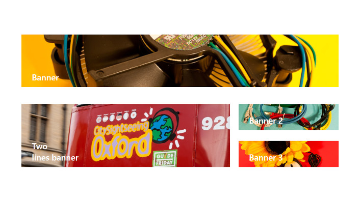

# Banner Web Part
Inspired by react-banner from [SharePoint Starter Kit](https://github.com/pnp/sp-starter-kit.git).

This web part provides the ability to add a variable height image banner with a title and link. Supported in SharePoint Online (Modern pages).

Uses [Image Helper API](https://learn.microsoft.com/en-us/sharepoint/dev/spfx/image-helper-api). This allows for customers to store high-resolution images in SharePoint but not pay the download time penalty when those images are used.

For more information see [CHANGELOG](CHANGELOG.md) file.

## Properties

The `Banner` webpart can be configured with the following properties:

| Title | Type | Description |
| ---- | ---- | ---- |
| Image URL | string | The url of the banner image.  Supports files from sharing links or relative/absolute urls. |
| Label | string | The text message or title you want displayed on the banner image. (Max. two lines.) |
| Banner height | number | Provides the fixed height in px of the banner image. (Default: 200px) |
| Link URL | string | The banner hyperlink.|

## Install package to SharePoint:
- Add `spfx-banner.sppkg` to SharePoint AppCatalog and deploy
- Add the web part `Banner` to a SharePoint page and enjoy
- Configure the web part to update its properties.

## Disclaimer
THE SOFTWARE IS PROVIDED "AS IS", WITHOUT WARRANTY OF ANY KIND, EXPRESS OR IMPLIED, INCLUDING BUT NOT LIMITED TO THE WARRANTIES OF MERCHANTABILITY, FITNESS FOR A PARTICULAR PURPOSE AND NONINFRINGEMENT. IN NO EVENT SHALL THE AUTHORS OR COPYRIGHT HOLDERS BE LIABLE FOR ANY CLAIM, DAMAGES OR OTHER LIABILITY, WHETHER IN AN ACTION OF CONTRACT, TORT OR OTHERWISE, ARISING FROM, OUT OF OR IN CONNECTION WITH THE SOFTWARE OR THE USE OR OTHER DEALINGS IN THE SOFTWARE.

## License
Licensed under the [MIT](LICENSE.md) License.

## Minimal Path to Awesome

- Download this repository
- Install development toolchain prerequisites The SharePoint Framework development and build toolchain leverages various popular open-source tools. While most dependencies are included in project, you need to install a few dependencies globally on your workstation.

  - Install Gulp: `npm install gulp-cli --global`
  - Install Yeoman: `npm install yo --global` Important: Yeoman v4.x is required by the SPFx v1.13 forward.
- In the command line (in a package directory) run:
  - Install the dependencies to the local node_modules folder: `npm install`
  - Create the solution package (sppkg file) in sharepoint\solution folder: `npm run dist`

